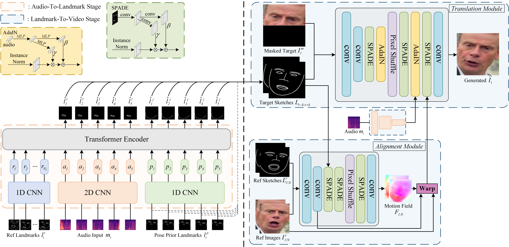

# IP_LAP: Identity-Preserving Talking Face Generation with Landmark and Appearance Priors （CVPR 2023）

paddlepaddle implementation for our CVPR2023 paper "**I**dentity-**P**reserving Talking Face Generation with **L**andmark and **A**ppearance **P**riors".



[[Paper]](https://arxiv.org/abs/2305.08293) [[Demo Video]](https://youtu.be/wtb689iTJC8)

## Requirements
- Python 3.8
- paddlepaddle 2.5.2
- ffmpeg

run:
```
pip install -r requirements.txt
```
## Test
```
CUDA_VISIBLE_DEVICES=0 python inference_single.py
```
To inference on other videos, please specify the `--input` and `--audio` option and see more details in code.

## Train
### download LRS2 dataset
Our models are trained on LRS2. Please go to the [LRS2](https://www.robots.ox.ac.uk/~vgg/data/lip_reading/lrs2.html) website to download the dataset. LRS2 dataset folder structure is following:
```
data_root (mvlrs_v1)
├── main, pretrain (we use only main folder in this work)
|	├── list of folders
|	│   ├── five-digit numbered video IDs ending with (.mp4)
```
`main folder` is the `lrs2_video` mentioned below.

### preprocess the audio
extract the raw audio and Mel-spectrum feature from video files by running: 
```
CUDA_VISIBLE_DEVICES=0 python preprocess_audio.py --data_root ....../lrs2_video/ --out_root ..../lrs2_audio
```
### preprocess the videos' face 

extract the cropped face, landmarks and sketches from video files by running: 

```
CUDA_VISIBLE_DEVICES=0 python preprocess_video.py --dataset_video_root ....../lrs2_video/ --output_sketch_root ..../lrs2_sketch --output_face_root ..../lrs2_face --output_landmark_root ..../lrs2_landmarks
```

### train Landmark generator

train the landmark generator network by running:

```
CUDA_VISIBLE_DEVICES=0 python train_landmarks_generator.py --pre_audio_root ..../lrs2_audio --landmarks_root ..../lrs2_landmarks
```
The models are trained until the eval_L1_loss no longer decreases (about 6e-3).
Under the default batchsize setting on a single RTX 3090, our model stopped at epoch 1837(610k iteration) with eval_L1_loss 5.866 e-3, using no more than one day.

### train Video Renderer
Training for the video renderer is similar (on four RTX 3090). Train it until the FID no longer decreases (about 20 or less).
train the video renderer network by running:
```
CUDA_VISIBLE_DEVICES=0,1,2,3 python train_video_renderer.py --sketch_root ..../lrs2_sketch --face_img_root ..../lrs2_face  --audio_root ..../lrs2_audio
```
Note that the translation module will only be trained  after 25 epochs, thus the fid and running_gen_loss will only decrease after epoch 25. 


